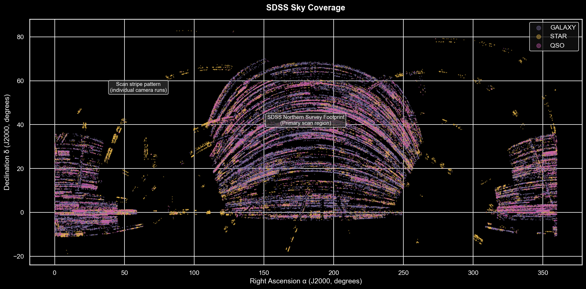

# Analysis of the Sloan Digital Sky Survey DR17
Brief exploration of the spectral and photometric properties of objects classified by the SDSS DR17, sourced from Kaggle (fedesoriano, 2022).


## How It's Made

**Tech Used:** Python, VS Code, Jupyter Notebooks

Analysis involved initial inspection, data parsing and maintenance, direct comparison of observed physical and photometric properties. Pandas, numpy, matplotlib and seaborn utilised for mathematical manipulation as well as presentation of data in graphical form. Astropy utilised to facilitate direct comparisons between observed datapoints and categorised celestial objects.



## Key Findings

Redshift proved the strongest discriminator between object classes. Stars clustered at z ≈ 0, galaxies exhibited a bimodal distribution reflecting deliberate SDSS survey targeting, and quasars showed a broad distribution consistent with their ancient and distant nature.

A single anomalous observation was identified through sentinel value detection (-9999.0 across filters u, g, and z) and traced via the SDSS SkyServer database to SDSS J145601.56-003727.4. This was shown to be an edge-of-field observation from March 1999.

Photometric analysis demonstrated clear distinctions between apparent and intrinsic magnitude i.e. quasars appeared faintest across all filters despite being intrinsically the most luminous class.

Sky coverage map demonstrated the SDSS northern survey footprint as well as individual camera scan stripes.

## Project Structure

```
sdss-eda/
├── data/
│   └── star_classification/
│       └── star_classification.csv
├── images/
│   └── class_distribution.png
│   └── filter_g.png
│   └── filter_i.png
│   └── filter_r.png
│   └── filter_u.png
│   └── filter_z.png
│   └── redshift_distribution.png
│   └── skymap.png
│   └── spectral_energy_distribution.png
├── notebooks/
│   └── sdss_eda.html
│   └── sdss_eda.ipynb
├── LICENSE
└── README.md
```

## Further Work

Analysis lays the framework for further exploration and colour index as well as temporal analysis. Redshift and photometric features provide the foundations for supervised classification modelling.

## Licence
This project is licensed under the MIT Licence.

Data sourced from the Sloan Digital Sky Survey DR17, released under public domain. Dataset compiled by fedesoriano (2022), sourced from Kaggle under CC0 Public Domain.
